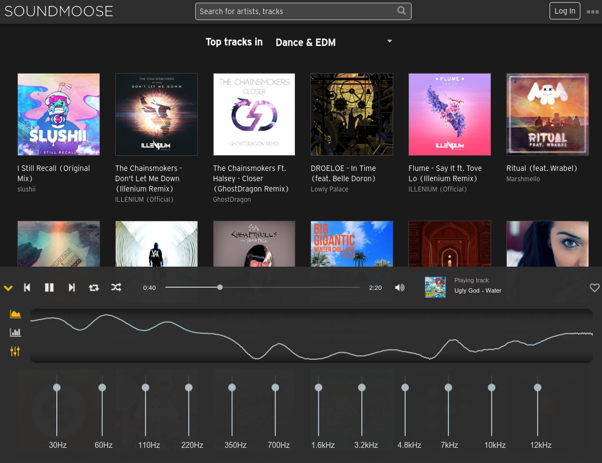

# SoundMoose

[](https://travis-ci.org/hrr20-over9000/SoundMoose)

## About

[SoundMoose](http://www.soundmoose.com) is a non-commercial music platform where you can listen to and discover new music. Create an account to access saved playlists, add tracks to your favorites, and play a "Guess the song" game with your friends!

Our code is based on TypeScript, Angular 2, nrgx/store, Ruby, and Django. For audio and animations, we use Web Audio API and ThreeJS.

All source code is available under the MIT license.

Many thanks to Last.fm, YouTube, Spotify, and SoundCloud for generously providing us with API access!

## Special thanks to

  - Stefan Ruijsenaars
  - Howard Xue
  - Doug Vaughn
  - Calvin Holloway

  
  
  
  


## Usage

Fork/Clone this repo, create a branch and hack away! Feel free to create a pull request with any suggested changes or bug-fixes.

### Installing Dependencies

NOTE: You will require API keys in order to make the app run on your local machine. Please contact the team for help getting set up with these!

Once you have your key file, from within the root directory, to build dev version:

```sh
npm install
npm start
```

From within the root directory, to build/serve prod version:

```sh
npm install
npm run build:prod
npm run server:prod
```

## Contributing

See [CONTRIBUTING.md](CONTRIBUTING.md) for contribution guidelines.

## Style Guide

[Angular 2 Style Guide](https://angular.io/docs/ts/latest/guide/style-guide.html#!#naming)

## Server Maintenance
### Note: The below is provided for team reference.

To start the main production server from project root:
```
npm run build:prod
npm run server:prod
```

To start forwarding proxy from project root:
```
node proxy/proxy.js
```

Using a clone of https://github.com/soundcloud/waveformjs with the dependancies and gems installed, to start Ruby Waveform service from /var/waveformjs:
```
bundle exec rackup
```

With Python and Django installed, to start Django REST server within /var/www/soundmoose.com/server/project/ directory:
```
python manage.py runserver 0.0.0.0:8000
```

> Note: for info on how the virtual environment was set up visit http://docs.python-guide.org/en/latest/dev/virtualenvs/

To manage Django server, visit http://138.197.88.233:8000/admin/

To view API information, visit http://138.197.88.233:8000/api/

Useful commands:

netstat -lpn |grep :9292     <- django server port
kill -9 PID                <- kill all at PID
